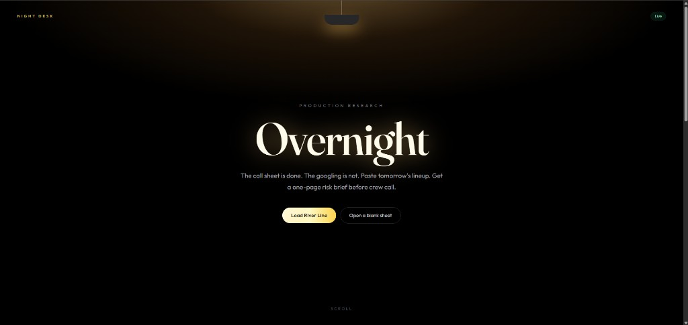
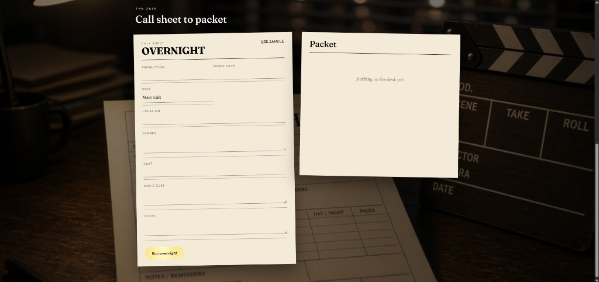

# Overnight

**Paste tomorrow's call sheet. Overnight searches the live web and drops a one-page risk brief before crew call.**

A production-office agent for the Google Cloud **Agentic Cinema** hackathon. **Track: Parallel.**

Overnight is a desk a coordinator can use the night before a shoot. You load tomorrow's call sheet. A Gemini agent (Google ADK) runs live Parallel Search queries — location, talent and news, competing productions, and music cues — then writes a one-page brief: **proceed**, **watch**, or **ask legal**, with sources.





## The job

The call sheet is done. The research is not.

Before crew call, someone still has to find out whether the street is in the news, whether another unit already owns the block, whether a name on the sheet just became a problem, and whether that needle-drop is going to get legal on the radio. That work is usually tabs, Slack, and hope. It is also the difference between wrapping and losing a day.

Overnight is that night desk.

## What you see

1. Load the sample shoot (**River Line** at the Brooklyn Navy Yard) or paste your own sheet.
2. Click **Run overnight**.
3. Gemini decides which Parallel searches to fire. You see the desk working.
4. A stamped brief lands: headline, verdict, flags, source links.

Sample production is fictional. The location is real on purpose, so Parallel hits live pages instead of a fake database.

## Runtime integrations

Google Cloud and Parallel are imported and called when a brief is generated.

| Integration | Where it runs |
| --- | --- |
| Google ADK agent + runner | [`app/agent.py`](app/agent.py) (`google.adk.agents.llm_agent.Agent`, `InMemoryRunner`) |
| Gemini / `google-genai` | [`app/agent.py`](app/agent.py) (user turn + fallback generate_content) |
| Parallel Search API | [`app/tools.py`](app/tools.py) — `from parallel import Parallel` then `client.search(...)` |

Tools the agent can call (each one hits Parallel):

- `search_location_risks`
- `search_talent_news`
- `search_competing_productions`
- `search_music_clearance`

## Architecture

```
Call sheet UI  ->  FastAPI /api/overnight
                      ->  Google ADK (Gemini)
                            ->  Parallel Search (location)
                            ->  Parallel Search (talent)
                            ->  Parallel Search (productions)
                            ->  Parallel Search (music)
                      ->  JSON brief  ->  stamped packet UI
```

Frontend: React, Vite, Tailwind. [Anime.js](https://animejs.com/) for the masthead and verdict stamp. [React Bits](https://reactbits.dev/get-started/index) Aurora background. [21st.dev](https://21st.dev/)-style shimmer button.

## Local setup

Python 3.11+ and Node 20+.

```bash
cp .env.example .env
```

Set `GOOGLE_API_KEY` and `PARALLEL_API_KEY`. Keys: [Google AI Studio](https://aistudio.google.com/apikey) and [Parallel](https://platform.parallel.ai). Do not commit `.env`.

```bash
python -m venv .venv
source .venv/bin/activate
pip install -r requirements.txt
uvicorn app.main:app --reload --port 8080
```

```bash
cd frontend
npm install
npm run dev
```

Open http://127.0.0.1:5173. The UI proxies `/api` to port 8080.

On Windows, `run.cmd` starts both processes.

## Deploy

The API can take 30–60 seconds because it runs several live searches. Deploy the Docker image (`Dockerfile`) as a long-running web service on Render or Google Cloud Run.

Required environment variables:

- `GOOGLE_API_KEY`
- `PARALLEL_API_KEY`
- `GEMINI_MODEL` (optional; defaults to `gemini-3.6-flash`)

Health check: `GET /api/health`

## License

MIT. See [`LICENSE`](LICENSE).
